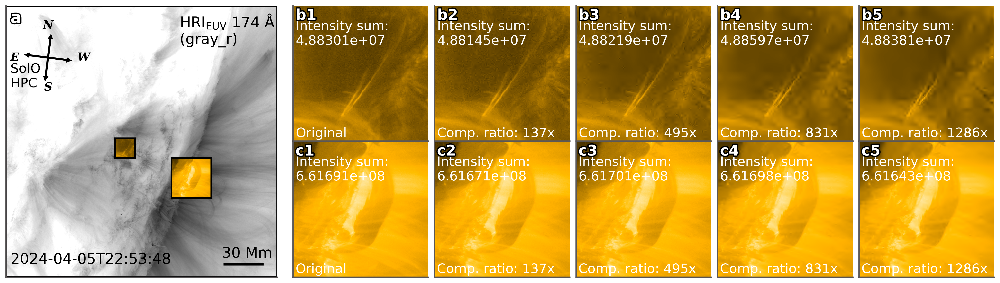

# SolarZip: A Efficient Error-bounded Lossy Compression Framework for Soalr EUV Data

[](https://isocpp.org/) 
[](https://opensource.org/licenses/Apache-2.0) 
[](https://github.com/elasticmm/elasticmm) 
[](https://elasticmm.readthedocs.io/) 


SolarZip is a compression framework designed for solar Extreme Ultraviolet (EUV) imaging data. Its purpose is to efficiently and adaptively compress the vast amounts of observational data from solar missions while ensuring its scientific usability.🌞

This framework is specifically optimized for data from the Solar Orbiter's Extreme Ultraviolet Imager (EUI) and can significantly reduce data volume, offering a promising data management solution for deep space missions like the Solar Orbiter.🚀


## ✨Key Feature

* **High-Efficiency Compression:** Achieves 3-50 times higher compression ratios compared to traditional algorithms.
* **Adaptive Strategy:** Employs an adaptive hybrid compression strategy with optimized interpolation predictors.
* **Scientific Usability:** Integrates a two-stage evaluation framework with distortion analysis and downstream scientific workflows to ensure that observational analysis is not affected, even at high compression ratios.
* **Significant Results:** Achieved up to an 800x reduction for Full Sun Imager (FSI) data and a 500x reduction for High Resolution Imager (HRI_EUV) data.

## 📊Compression performance

SolarZip demonstrated the overall best performance on the rate-distortion curve.


## 👁️Vision Example

### Full Solar Imager(FSI) dataset example:


### Hight Resolution Imager(HRI) dataset example:


## ⚙️Build Instructions

### requisites
Before you begin, ensure you have the following software and libraries installed:
* Python(3.8 or newer)
* Numpy
* Astropy
* Sunpy

You can install most dependencies using pip:
```
pip install numpy sunpy 
```

### Installation

1. Clone the repository to your local machine:
   ```
   git clone https://github.com/CapitalLiu/SolarZip.git
    ```
2. Navigate to the project directory and create build directory:
   ```
   cd SolarZip
   mkdir build && cd build
   ```
3. Execute the make command to compile the project
   ```
   cmake ..
   make -j8
   make install
   #The executable will now appear in the build/bin
   ```

### Usage

Command-line Syntax:
```
SolarZip -dim_num -bound_mode -bound_num <dataDir>
#compress files in the target directory.
```

Example Commands:
* Relative error bound mode
  ```
  ./bin/SolarZip 3 REL 1e-3 /SolarZip/data
  ```
* Absolute error bound mode
  ```
  ./bin/SolarZip 3 ABS 1e-3 /SolarZip/data
  ```
  We have made the test data publicly available. If you're interested, you can access it here👉: 
https://github.com/CapitalLiu/SolarZip-TestData
## 📚Citation
If you use SolarZip in your research, please cite our paper:
```
@misc{liu2025solarzip,
      title={SolarZip: An Efficient and Adaptive Compression Framework for Solar EUV Imaging Data}, 
      author={Zedong Liu and Song Tan and Alexander Warmuth and Frédéric Schuller and Yun Hong and Wenjing Huang and Yida Gu and Bojing Zhu and Guangming Tan and Dingwen Tao},
      year={2025},
      eprint={2504.13504},
      archivePrefix={arXiv},
      primaryClass={astro-ph.IM}
}
```

   
